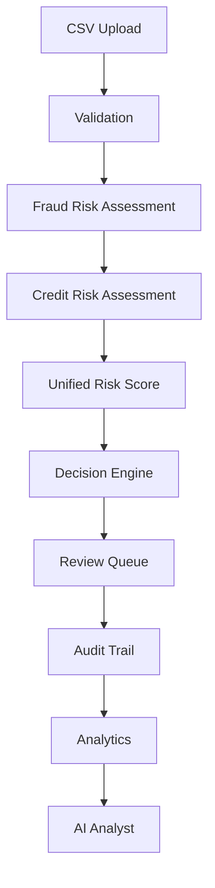
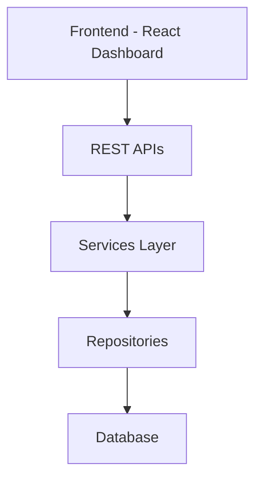
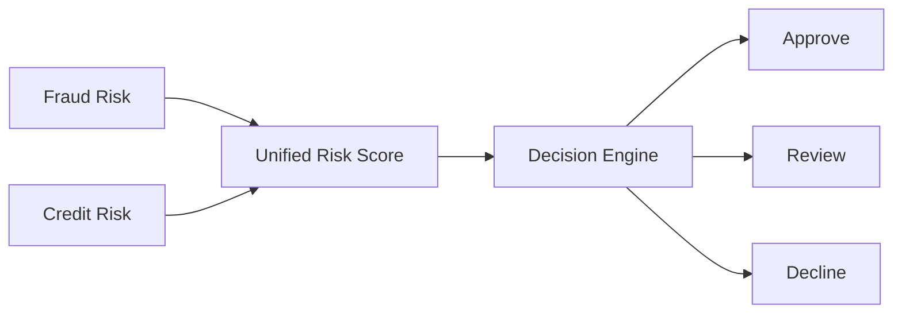

<div align="center">

# VERIS

### Enterprise Unified Risk Intelligence Platform for Explainable Transaction Decisioning

*Turning fragmented risk signals into transparent, auditable, operational decisions.*


</div>

---

VERIS is an enterprise-grade risk intelligence platform built to demonstrate how financial institutions convert disconnected risk signals — fraud indicators, credit behavior, transaction patterns — into a single, explainable decision. It is not a fraud-detection script. It is a full decisioning system: ingestion, scoring, human review, audit, analytics, and AI-assisted investigation, working together the way a real risk operations platform would.

The project is deliberately scoped around **Decision Intelligence**, not model accuracy. Anyone can train a classifier. VERIS exists to show what happens *after* the model produces a number — how that number becomes a governed, reviewable, business-ready decision.

---

## Executive Summary

VERIS is a risk intelligence platform that converts transaction-level fraud and credit signals into governed, explainable decisions. It evaluates each transaction through independent fraud and credit risk engines, fuses the results into a Unified Risk Score, and routes the outcome through a Decision Engine that approves, declines, or escalates the case to human review. Every decision is logged with its contributing factors, every review action is traceable, and every outcome feeds business analytics. VERIS focuses on the decision layer — the policy, oversight, and audit infrastructure that sits around a risk model — rather than on model accuracy alone.

---

## Repository Navigation

This repository is organized into the following major modules:

- **veris-backend/** — FastAPI backend, risk engines, services, APIs, and machine learning pipeline.
- **veris-frontend/** — React dashboard, analytics, review workflows, and reporting interface.
- **docs/** — Product architecture, technical documentation, and design decisions.
- **datasets/** — Training datasets and supporting data assets.
- **scripts/** — Data preparation, model training, and validation utilities.

Each module is independently documented while contributing to the overall VERIS platform.

## Who is VERIS for?

VERIS is designed around the people who actually operate a risk decisioning platform day to day, not just the model that powers it.

**Fraud Analysts** use the Review Queue and AI Analyst to investigate flagged transactions with full context — score breakdowns, contributing factors, and prior history — instead of a bare prediction.

**Risk Analysts** use Analytics and the Simulator to understand how current policy thresholds behave across transaction populations and to test changes before they go live.

**Compliance Teams** rely on the Audit module to reconstruct, on demand, why any individual decision was made and who acted on it.

**Operations Teams** use the Dashboard and Alerts to monitor platform health and review-queue throughput in real time.

**Business Managers** use Reports to consume decisioning outcomes and trends without needing to operate the platform directly.

**Decision Support Teams** use the Decision Engine and Unified Risk Score as a consistent, explainable basis for policy discussions, removing ambiguity from "why was this declined" conversations.

---
## Live Demonstration

### Live Frontend

https://veris-mu.vercel.app/

### Live Backend API

https://veris-backend-m8xv.onrender.com/

### API Documentation

https://veris-backend-m8xv.onrender.com/docs

---

### Deployment Note

VERIS is publicly deployed using the free tiers of Vercel and Render for portfolio demonstration.

The complete Machine Learning inference pipeline (Random Forest + XGBoost + Explainability) requires more memory than is available on Render's free 512 MB instance. As a result:

- Dashboard
- Analytics
- Reports
- Transaction APIs
- User Interface
- REST API Documentation

are fully available online.

The full CSV upload and end-to-end scoring workflow is demonstrated locally or on higher-memory infrastructure using the exact same codebase.

This limitation is caused by cloud infrastructure constraints rather than application logic and does not affect the architecture or functionality of the project.

## Business Problem

Modern financial institutions evaluate millions of transactions every day where both false approvals and false declines carry significant financial, operational and reputational consequences.

Financial institutions process transaction volumes that make manual review impossible, yet the cost of a wrong decision is high in both directions. Approving a fraudulent transaction creates direct financial loss. Declining a legitimate one damages customer trust and revenue. This tension is the starting point for every serious risk platform.

**Fraud detection** exists because financial loss from fraudulent transactions is immediate and difficult to recover. Institutions need a way to flag suspicious behavior before money moves, not after.

**Credit risk assessment** exists because not every risky transaction is fraudulent — some are simply unlikely to be repaid or honored. Distinguishing fraud risk from credit risk changes how an institution responds; the two require different interventions.

**Decision engines** exist because risk scores on their own are not decisions. A score of 0.82 means nothing to an operations team unless it is translated into an action — approve, decline, or escalate — under a consistent, defensible policy.

**Human review** exists because no automated system should have unchecked authority over financial outcomes. Edge cases, ambiguous patterns, and high-value transactions need a person in the loop, and that person needs context, not just a number.

**Auditability** exists because financial decisions are subject to regulatory scrutiny. An institution must be able to reconstruct *why* a decision was made, weeks or years later, on demand.

**Explainability** exists because regulators, customers, and internal compliance teams are entitled to a reason. "The model said so" is not an acceptable answer in a regulated industry.

These six requirements do not operate independently in a mature institution — they form a single pipeline. VERIS exists to model that pipeline end to end.

---

## Why VERIS?

Most portfolio projects in this space stop at a trained model and a confusion matrix. That demonstrates machine learning competence, but it does not demonstrate an understanding of how financial institutions actually consume risk scores.

**VERIS demonstrates the decision layer rather than the prediction layer.** A model that outputs a probability has not made a decision — it has produced an input to one. The decision layer is where that input is converted into policy-governed action: who gets escalated, who gets declined, what gets logged, and what gets explained. This layer matters more than prediction accuracy in production financial systems because it is the layer regulators audit, customers question, and operations teams live in every day. A highly accurate model wrapped in no governance is a liability; a moderately accurate model wrapped in solid decisioning infrastructure is operable.

VERIS exists to show the layer that is consistently missing. It answers questions that a standalone model cannot:

- What happens when fraud risk and credit risk disagree?
- How is a single score derived from multiple, independently-computed risk signals?
- Who reviews a borderline case, and what do they see when they do?
- How does an institution prove, after the fact, why a transaction was declined?
- How do operational teams monitor decisioning quality over time?

Modern financial institutions do not deploy isolated models into production. They deploy decision systems — platforms that wrap models in policy, oversight, logging, and reporting. VERIS is built around that reality. The risk models in this project are intentionally simplified; the decisioning architecture around them is not.

---

## Product Vision

To make risk-based decisioning in financial systems **transparent, governed, and explainable by design** — so that every automated decision can be understood, challenged, and trusted by the humans accountable for it.

---

## Product Philosophy

**Multi-Risk Assessment**
A transaction is rarely risky for a single reason. Collapsing fraud risk and credit risk into one undifferentiated score discards information the decision layer needs to respond correctly. VERIS computes these signals independently and unifies them only at the point where a decision must be made, preserving the reasoning behind each component.

**Explainable Decisions**
An output that cannot be traced to its inputs cannot be defended — to a regulator, a customer, or an internal auditor. Explainability is treated as a system requirement, enforced at the point each score is generated, not retrofitted after the fact.

**Human Oversight**
Full automation without a review path is an unacceptable failure mode in financial decisioning. VERIS routes uncertain or high-impact cases to a review queue by design, keeping a human decision point in the loop wherever automated confidence is insufficient.

**Governance**
State changes — decisions, overrides, reviewer actions — are written once and never mutated. Governance in VERIS is not a separate module; it is a constraint that every other module operates under.

**Business Intelligence**
Decision history is a dataset, not a byproduct. VERIS persists every outcome in a form that supports aggregation and trend analysis, so the system's operational history remains queryable rather than disappearing into logs.

---

## Design Principles

**Separation of Concerns**
Presentation, business logic, and persistence are isolated into distinct layers. The frontend has no awareness of scoring logic; services have no awareness of how data is stored. Each layer changes independently of the others.

**Modularity**
Fraud risk, credit risk, scoring, and decisioning are implemented as discrete services rather than one monolithic pipeline. Each can be tested, replaced, or extended without touching the others.

**Explainability**
Every score carries its contributing factors as structured output, not as an afterthought generated for a UI. Explainability is a property of the data model, not a presentation feature.

**Traceability**
Every transaction can be traced from ingestion through final decision via the audit trail. No state transition in the pipeline is unrecorded.

**Extensibility**
New risk signals, scoring strategies, or decision policies can be added at the service layer without altering the API contract or the frontend.

**Reproducibility**
Given the same input data and policy configuration, the platform produces the same decision. Determinism in scoring and decisioning is treated as a correctness requirement, not an implementation detail.

---

## Core Capabilities

**Transaction Intelligence** — Structured ingestion and normalization of transaction data, preparing raw records for consistent risk evaluation regardless of source format.

**Risk Intelligence** — Independent fraud and credit risk scoring engines that evaluate distinct behavioral and financial signals rather than collapsing everything into one opaque score.

**Decision Intelligence** — A policy-driven engine that converts unified risk scores into operational outcomes (approve / decline / review), with the reasoning behind each outcome preserved.

**Operational Intelligence** — A review workflow that gives human analysts the context they need — score breakdowns, contributing factors, transaction history — to act quickly and consistently.

**Business Intelligence** — Dashboards and analytics that aggregate decision outcomes over time, surfacing trends in risk exposure, reviewer throughput, and decision accuracy.

**Explainability** — Every score is decomposed into contributing factors, so the question "why was this flagged" always has a concrete answer.

**Analytics** — Historical and real-time views into platform performance, decision volume, and risk distribution, designed for both operational and strategic audiences.

---

## Enterprise Workflow

The diagram below illustrates the end-to-end lifecycle of a transaction as it moves through the platform, from ingestion to AI-assisted analysis.



Each stage is independently testable and independently logged. A transaction that fails validation never reaches the risk engines; a transaction that clears both risk engines but lands in an ambiguous score band is routed to the review queue rather than auto-decisioned. Every transition between stages is recorded in the audit trail, giving the platform a complete, replayable history of how each decision was reached.

---

## Enterprise Architecture

VERIS follows a layered architecture that separates presentation, business logic, and persistence — a structure chosen specifically because it mirrors how financial platforms are built in practice, where each layer can be scaled, secured, and audited independently.



**Frontend** — The presentation layer. Renders dashboards, review queues, analytics, and reports; communicates exclusively through REST APIs and holds no business logic of its own.

**REST APIs** — The contract layer. Exposes well-defined endpoints for transactions, risk scoring, reviews, and reporting, decoupling the frontend from internal implementation details.

**Services Layer** — The business logic layer. Hosts the fraud risk engine, credit risk engine, unified scoring logic, and decision engine. This is where domain rules live.

**Repositories** — The data access layer. Abstracts persistence operations so that services never interact with the database directly, keeping business logic independent of storage implementation.

**Database** — The persistence layer. Stores transactions, scores, decisions, review actions, and audit records as the system of record for the platform.

---

## Unified Risk Intelligence



**Fraud Risk** evaluates a transaction for indicators of malicious intent — patterns associated with stolen credentials, account takeover, or anomalous behavior inconsistent with a legitimate user's history.

**Credit Risk** (modeled here as a proxy credit risk assessment) evaluates the likelihood that a transaction represents a financial obligation the counterparty is unlikely to honor, independent of whether fraudulent intent is present.

**Unified Risk Score (URS)** combines the outputs of both engines into a single normalized score. The purpose of unification is not to obscure the two signals but to give the Decision Engine one consistent input while preserving the individual fraud and credit components for explainability and review.

**Decision Engine** applies policy thresholds to the URS to determine an outcome — approve, decline, or escalate to review — and attaches the contributing reasoning to that outcome.

> **Note on methodology:** The Unified Risk Score implemented in this project is a simplified, educational approximation of the kind of multi-signal decisioning logic used in enterprise risk systems. It is designed to illustrate the *architecture* of fusing independent risk signals into one decision — it is not, and does not claim to be, the actual scoring formula used by any bank or financial institution. Real-world systems are governed by proprietary models, regulatory constraints, and far larger feature sets than this project implements.

---

## Real-World Applications

The architecture demonstrated in VERIS generalizes beyond this specific implementation. The same decision-layer pattern — independent risk scoring, score fusion, policy-driven decisioning, human review, and audit — applies across several domains:

- **Banking** — Transaction approval and account-level risk decisioning.
- **FinTech** — Payment authorization and onboarding risk checks for digital-first financial products.
- **Digital Payments** — Real-time decisioning on payment authorization requests.
- **Insurance** — Claims risk triage and underwriting decision support.
- **Credit Decisioning** — Loan and credit line approval workflows requiring explainable outcomes.
- **Transaction Monitoring** — Ongoing surveillance of account activity for suspicious patterns.
- **Compliance** — Regulatory reporting and decision traceability requirements (e.g., AML, KYC-adjacent workflows).
- **Internal Risk Operations** — Any internal team that needs to convert a model score into a governed business action.

---

## Platform Modules

**Dashboard** — The operational home screen, surfacing real-time platform health, transaction volume, and pending review counts at a glance.

**Transactions** — A searchable, filterable ledger of all processed transactions along with their computed risk scores and decisions.

**Upload Center** — The ingestion point for transaction batches, handling validation feedback before data enters the risk pipeline.

**Review Queue** — The workspace for human analysts, presenting flagged transactions alongside score breakdowns so reviewers can make informed, consistent decisions.

**Analytics** — Aggregated views of decision outcomes, risk distribution, and operational throughput over time, intended for risk managers and business stakeholders.

**Research** — A deeper investigation workspace for analysts examining specific accounts, patterns, or clusters of related transactions.

**Reports** — Structured, exportable summaries of platform activity intended for stakeholders who need outcomes without navigating the live system.

**Simulator** — A sandbox for testing how hypothetical transactions would be scored and decisioned under current policy, useful for policy tuning and training.

**Alerts** — Notifications surfaced when risk patterns or operational thresholds warrant immediate attention.

**Audit** — The immutable record of every decision, override, and review action, supporting traceability and regulatory accountability.

**AI Analyst** — An AI-assisted investigation layer that synthesizes transaction history, risk factors, and prior decisions into a natural-language summary, helping analysts move through cases faster without losing context.

---
## Repository Highlights

- Enterprise-style layered architecture
- Service–Repository backend design
- RESTful API architecture using FastAPI
- React-based analytics dashboard
- Explainable AI integration
- Unified Risk Scoring Engine
- Human Review Workflow
- Audit Trail
- Business Analytics Dashboards
- Modular and extensible project structure


## Technology Stack

**Backend**

| Component | Technology |
|---|---|
| Language | Python |
| API Framework | FastAPI |
| Risk Logic | Custom rule-based + statistical scoring services |
| Task Structure | Service-Repository pattern |

**Frontend**

| Component | Technology |
|---|---|
| Framework | React |
| Styling | Tailwind CSS |
| State Management | React Hooks / Context |
| Charting | Recharts |

**Machine Learning**

| Component | Technology |
|---|---|
| Modeling | Scikit-learn |
| Explainability | Feature contribution analysis (SHAP-inspired) |
| Data Handling | Pandas, NumPy |

**Database**

| Component | Technology |
|---|---|
| Engine | SQLite (Development) |
| ORM | SQLAlchemy |
| Migration Path | PostgreSQL (Future) |

**Visualization**

| Component | Technology |
|---|---|
| Dashboards | Recharts |
| Diagrams | Mermaid |
| Reporting | Custom export templates |

---
## Skills Demonstrated

This project demonstrates practical experience in:

- Business Analytics
- Financial Risk Analytics
- Fraud Detection
- Decision Intelligence
- Explainable AI
- Machine Learning Integration
- Enterprise Software Architecture
- REST API Development
- Dashboard Design
- Data Engineering
- Backend Development
- Frontend Development
- Deployment

## Folder Structure

```
Business-Analytics-Projects/
└── VERIS/
    ├── backend/
    ├── frontend/
    ├── docs/
    ├── datasets/
    └── screenshots/
```

This README documents the structure at the level it is stable today. Subdirectory-level structure within `backend/` and `frontend/` will be documented separately as those modules stabilize.

---

## REST API Overview

VERIS exposes a set of REST API categories rather than a single monolithic endpoint surface, keeping each domain independently versionable.

| Category | Purpose |
|---|---|
| `/transactions` | Ingestion, retrieval, and listing of transaction records |
| `/risk` | Fraud and credit risk scoring operations |
| `/decisions` | Decision Engine outcomes and policy evaluation |
| `/reviews` | Review queue management and analyst actions |
| `/analytics` | Aggregated metrics and trend data |
| `/audit` | Immutable decision and action history |
| `/ai-analyst` | AI-assisted case summarization and investigation |

Detailed endpoint-level documentation is intentionally excluded from this overview; full specifications live in the API reference within `/docs`.

---

## Key Features

| Feature | Description |
|---|---|
| Multi-Signal Risk Scoring | Independent fraud and credit risk evaluation prior to score fusion |
| Unified Risk Score | A single, policy-ready score derived from multiple risk signals |
| Explainable Outcomes | Every decision includes a breakdown of contributing factors |
| Human Review Workflow | Structured escalation path for ambiguous or high-impact cases |
| Immutable Audit Trail | Full traceability of every decision and reviewer action |
| Business Analytics | Trend and performance dashboards for risk and operations teams |
| Decision Simulator | Policy testing against hypothetical transactions |
| AI-Assisted Investigation | Natural-language case summaries for faster analyst review |
| Modular Architecture | Clear separation between API, service, and data layers |

---

## Screenshots

> Screenshots will be added as the platform UI is finalized. Placeholders below indicate intended coverage.

| Module | Preview |
|---------|---------|
| Dashboard |  |
| Analytics |  |
| Reports |  |
| Alerts |  |
| AI Analyst |  |

---

## Installation

**Requirements**

- Python 3.10+
- Node.js 18+
- npm or yarn

**Backend Setup**

```bash
cd backend
python -m venv venv
source venv/bin/activate   # Windows: venv\Scripts\activate
pip install -r requirements.txt
uvicorn app.main:app --reload
```

**Frontend Setup**

```bash
cd frontend
npm install
npm run dev
```

The backend will be available at `http://localhost:8000` and the frontend at `http://localhost:5173` by default.

---

## Known Limitations

The current public deployment uses free cloud infrastructure.

Because the ML inference pipeline loads multiple analytical models simultaneously, the complete CSV upload workflow exceeds the memory available on the free Render instance.

This does not affect local execution or deployments on higher-memory infrastructure.

Future production deployments can use Docker containers and larger cloud instances to remove this limitation.

## Future Roadmap

- **Containerization** — Dockerize backend and frontend for consistent, portable deployment.
- **PostgreSQL Migration** — Move from SQLite to PostgreSQL for production-grade persistence.
- **Enterprise RBAC** — Introduce analyst, reviewer, and administrator roles with scoped permissions.
- **Real SHAP Integration** — Replace the current feature-contribution approximation with genuine SHAP value computation.
- **Streaming Ingestion** — Support real-time transaction streams alongside batch CSV upload.
- **Model Monitoring** — Track score drift and decisioning quality over time.
- **Decision Policy Configuration** — Allow threshold and routing rules to be managed as configuration rather than code.
- **Threshold Optimization** — Introduce data-driven tuning of approve/review/decline boundaries against labeled outcomes.
- **Cloud Deployment** — Reference deployment configuration for AWS/Azure/GCP.
- **Observability** — Centralized logging, metrics, and alerting for platform health.

---

## Project Status

| Attribute | Status |
|------------|--------|
| Version | Portfolio Release v1.0 |
| Development | Complete |
| Deployment | Live |
| Architecture | Stable |
| Future Enhancements | Planned |

---

## Related Portfolio

Explore the complete Business Analyst Portfolio featuring:

- Project A – Client Onboarding & KYC Workflow Optimization
- VERIS – Unified Risk Intelligence Platform
- Project B – Payment Exception & Reconciliation Workflow Redesign

Portfolio Website

(Portfolio link to be added after deployment.)

---

## Contact

**TR Vithun**

Business Analyst | FinTech | Decision Intelligence | Product Analytics

GitHub

https://github.com/Vithun10

LinkedIn

https://www.linkedin.com/in/vithuntr/ 

Portfolio

https://vithun-tr.vercel.app/project-a 

## License

This project is licensed under the **MIT License**. See the `LICENSE` file for full terms.

---

## Acknowledgements

VERIS was built as an exploration of how financial institutions translate fragmented risk signals into governed, explainable decisions — and as a demonstration that the most valuable part of a risk system is rarely the model itself, but everything built around it to make that model accountable. Feedback, issues, and contributions are welcome.


Pre-trained model artifacts are excluded from the repository due to GitHub size limits. They can be regenerated using the training scripts provided in scripts/.

