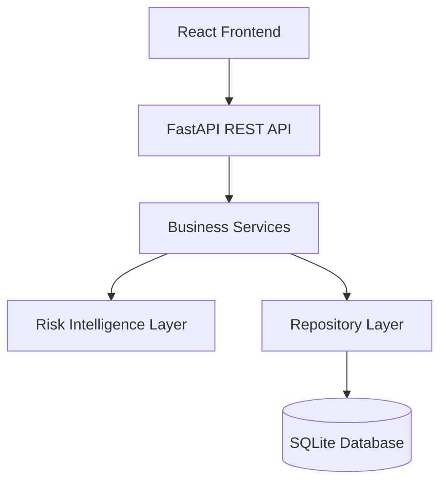
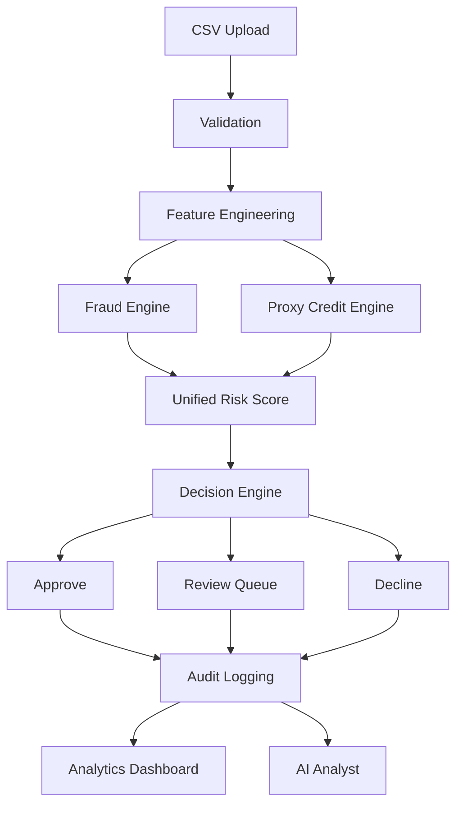

# System Architecture

---

**Project:** VERIS
**Document:** System Architecture
**Version:** 1.0 Portfolio Release
**Last Updated:** June 2026
---------------------------

# System Architecture

## Overview

VERIS follows a modular, layered architecture designed to separate user interaction, business logic, analytical processing, and data persistence into independent components. This separation improves maintainability, scalability, and readability while allowing each layer to evolve independently.

Rather than treating machine learning models as standalone components, VERIS integrates them into a complete transaction decisioning pipeline. The system transforms raw transaction data into explainable business decisions through a sequence of validation, feature engineering, risk assessment, decision intelligence, and operational reporting.

---

# Architecture Philosophy

The architecture is based on five guiding principles:

* **Separation of Concerns** – Each layer has a single, well-defined responsibility.
* **Modularity** – Components can be modified or extended without affecting unrelated modules.
* **Explainability** – Automated decisions are accompanied by interpretable reasoning.
* **Traceability** – Important system actions are recorded through audit logs.
* **Extensibility** – New analytical models or business rules can be integrated with minimal changes.

---

# High-Level Architecture

---

# Architectural Layers

## 1. Presentation Layer

The Presentation Layer consists of the React-based web application.

Responsibilities include:

* Dashboard visualizations
* Transaction monitoring
* Upload Center
* Review Queue
* Reports
* Research
* Simulator
* AI Analyst
* Audit Explorer

The frontend communicates exclusively through REST APIs and contains no business logic.

---

## 2. API Layer

The FastAPI application acts as the communication layer between the frontend and backend services.

Responsibilities include:

* Request validation
* Routing
* Response formatting
* Error handling
* Service invocation

Each functional module exposes its own API endpoints while sharing common application services.

---

## 3. Business Service Layer

The Service Layer contains the application's business logic.

Key responsibilities include:

* Upload validation
* Schema mapping
* Batch processing
* Fraud analysis
* Credit assessment
* Unified Risk Score calculation
* Decision generation
* Review workflow
* Audit logging
* Report generation

This layer orchestrates the complete transaction decision lifecycle.

---

## 4. Risk Intelligence Layer

The analytical layer combines multiple independent risk components.

Primary components include:

* Fraud Detection Engine
* Proxy Credit Engine
* Unified Risk Score Engine
* Decision Engine
* Explainability Engine

Each component contributes a specific analytical capability without being tightly coupled to the others.

---

## 5. Repository Layer

The Repository Layer abstracts all database interactions from the business logic.

Responsibilities include:

* Transaction persistence
* Audit record storage
* Upload batch tracking
* Data retrieval
* Query management

This abstraction enables future migration to other database systems with minimal changes to business services.

---

## 6. Data Layer

VERIS currently uses SQLite for development and demonstration purposes.

Stored information includes:

* Transaction records
* Risk scores
* Business decisions
* Upload batches
* Review outcomes
* Audit events

The architecture is designed to support migration to enterprise database systems such as PostgreSQL in future releases.

---

# End-to-End System Workflow

---

# Component Interaction

The system follows a request-driven architecture.

1. The user uploads a transaction dataset.
2. The Upload Center validates the dataset structure.
3. Features required by analytical models are generated.
4. Fraud and proxy credit assessments execute independently.
5. Their outputs are combined into a Unified Risk Score.
6. The Decision Engine determines the appropriate business outcome.
7. Transactions requiring manual intervention are routed to the Review Queue.
8. Final outcomes are persisted in the database.
9. Audit events are recorded.
10. Dashboards, reports, and AI Analyst consume the stored results.

---

# Design Decisions

## Why Layered Architecture?

Separating responsibilities simplifies testing, maintenance, and future enhancements.

---

## Why Independent Risk Engines?

Different analytical models evaluate different aspects of transaction risk. Independent models improve flexibility and allow future replacement without redesigning the entire platform.

---

## Why a Repository Layer?

Database operations remain isolated from business logic, enabling cleaner code and easier database migration.

---

## Why REST APIs?

REST provides a simple and well-understood interface between frontend and backend while supporting modular expansion.

---

# Scalability Considerations

Although VERIS is implemented as a portfolio project, its architecture supports several production-oriented enhancements:

* PostgreSQL or MySQL as the primary database
* Containerization using Docker
* Cloud deployment
* Enterprise authentication and authorization
* Asynchronous batch processing
* Streaming transaction ingestion
* Centralized logging and monitoring

These enhancements would improve scalability without requiring significant architectural changes.

---

# Current Limitations

The current implementation intentionally simplifies several enterprise concerns.

Examples include:

* SQLite instead of distributed databases
* Simulated role management instead of full RBAC
* Batch processing instead of real-time streaming
* Educational Unified Risk Score implementation
* Local deployment instead of cloud infrastructure

These simplifications allow the platform to focus on demonstrating architectural concepts while remaining suitable for educational purposes.

---

# Key Takeaways

* VERIS follows a modular layered architecture that separates presentation, business logic, analytics, and persistence.
* Machine learning models operate as components within a broader decision intelligence workflow rather than standalone systems.
* Explainability, auditability, and human review are treated as integral architectural principles.
* The architecture emphasizes maintainability, extensibility, and business-oriented transaction decisioning.
* While simplified for educational use, the overall design reflects concepts commonly found in enterprise risk intelligence platforms.
