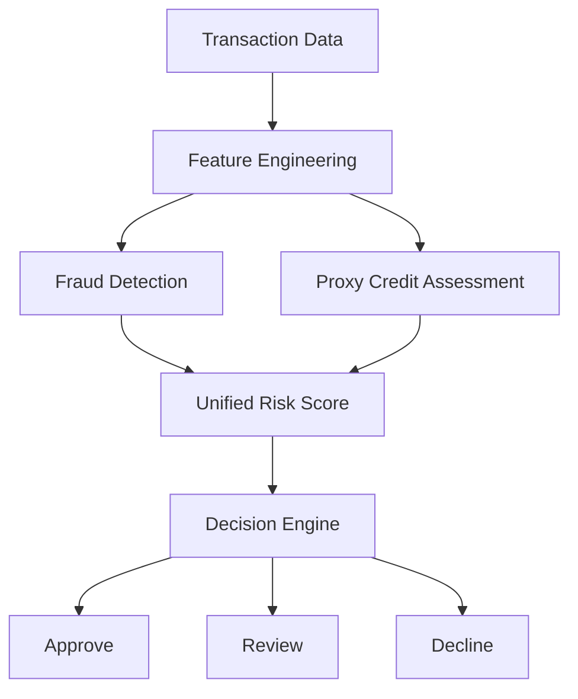
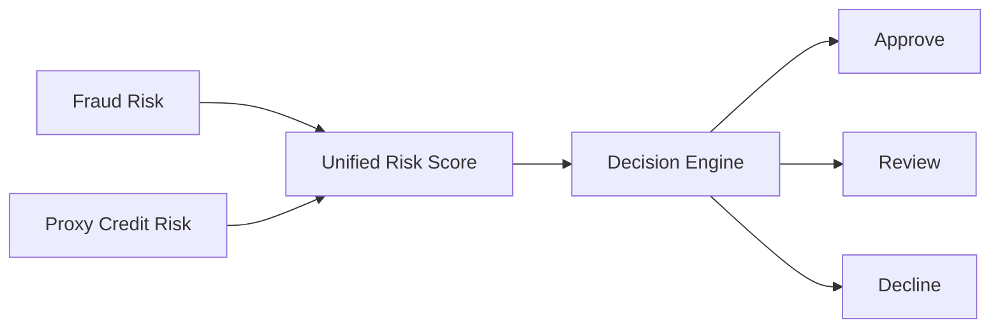

# Risk Engine and Machine Learning

---

**Project:** VERIS
**Document:** Risk Engine and Machine Learning
**Version:** 1.0 Portfolio Release
**Last Updated:** June 2026
---------------------------

# Risk Engine and Machine Learning

## Overview

The analytical core of VERIS is built around the concept of **multi-factor risk assessment**. Instead of relying on a single predictive model, the platform evaluates each transaction from multiple perspectives before producing a business decision.

The current implementation combines:

* Fraud Risk Assessment
* Proxy Credit Risk Assessment
* Unified Risk Score (URS)
* Decision Intelligence
* Explainability

This approach reflects how enterprise decision-support systems combine multiple analytical signals into a single operational outcome.

---

# Why Multiple Risk Engines?

Different analytical models answer different business questions.

| Analytical Component | Business Question                              |
| -------------------- | ---------------------------------------------- |
| Fraud Engine         | Is this transaction likely to be fraudulent?   |
| Proxy Credit Engine  | Does the customer appear financially reliable? |
| Unified Risk Score   | What is the overall business risk?             |
| Decision Engine      | What operational action should be taken?       |

No single model can capture every aspect of transaction risk. VERIS therefore separates these concerns into independent analytical components.

---

# Risk Intelligence Pipeline

---

# Feature Engineering

Before any model executes, transaction attributes are transformed into numerical features suitable for analytical processing.

Examples include:

* Transaction Amount
* Customer Behaviour
* Device Information
* Merchant Category
* Velocity Indicators
* Historical Activity
* Derived Risk Indicators

Feature engineering improves model consistency and provides standardized inputs for downstream analytical components.

---

# Fraud Detection Engine

## Purpose

Estimate the likelihood that a transaction represents fraudulent activity.

The fraud model identifies suspicious behavioural patterns using supervised machine learning.

Examples of risk indicators include:

* Abnormally high transaction amounts
* Unusual transaction timing
* Rapid transaction frequency
* Device anomalies
* Geographic inconsistencies

The model outputs a fraud probability that becomes one component of the overall decision process.

---

# Proxy Credit Engine

## Purpose

Estimate customer financial reliability using available transaction-related information.

Unlike traditional banking credit scoring, VERIS implements a simplified educational proxy model.

The objective is to demonstrate how an additional analytical dimension can complement fraud assessment.

The proxy score should be interpreted as an educational representation rather than an actual financial credit score.

---

# Unified Risk Score (URS)

## Purpose

The Unified Risk Score aggregates multiple independent analytical outputs into a single business-oriented risk indicator.

Instead of making decisions directly from one model, VERIS combines several perspectives before assigning a final decision.

The current URS implementation is intentionally simplified for educational purposes and is inspired by enterprise decisioning systems. It should not be interpreted as a production banking algorithm.

---

# Decision Engine

The Decision Engine converts the Unified Risk Score into an operational outcome.

Possible outcomes include:

| Decision | Purpose                             |
| -------- | ----------------------------------- |
| Approve  | Transaction considered acceptable   |
| Review   | Human analyst intervention required |
| Decline  | Transaction considered too risky    |

This additional decision layer separates analytical predictions from operational business actions.

---

# Explainability

Machine learning predictions alone are often insufficient for business operations.

VERIS incorporates explainability concepts to improve transparency.

The platform provides:

* Feature-level explanations
* Decision justifications
* AI Analyst summaries
* Human-readable reasoning

Explainability improves analyst confidence and supports governance requirements.

---

# Human-in-the-Loop Review

Certain transactions cannot be confidently approved or declined automatically.

These transactions are routed to the Review Queue.

Benefits include:

* Reduced false positives
* Reduced false negatives
* Better operational control
* Analyst oversight
* Continuous quality assurance

This reflects common enterprise practices where automated systems support, rather than replace, human decision-makers.

---

# Current Limitations

The analytical implementation is intentionally simplified.

Current limitations include:

* Educational datasets
* Simplified proxy credit model
* Static decision thresholds
* Batch processing
* Demonstration-oriented feature engineering

These trade-offs allow the platform to focus on architectural concepts while remaining suitable for academic and portfolio purposes.

---

# Future Enhancements

Potential improvements include:

* Dynamic threshold optimization
* Real-time scoring
* Ensemble learning
* Continuous model retraining
* Model monitoring
* Feature store integration
* Explainability dashboards
* Drift detection
* PostgreSQL-backed model storage

---

# Business Value

The analytical architecture demonstrates several enterprise concepts:

* Multi-factor risk assessment
* Decision intelligence
* Explainable AI
* Human oversight
* Operational governance
* Risk analytics

Although simplified, these concepts closely resemble the analytical workflows used in modern banking and fintech decision-support platforms.

---

# Key Takeaways

* VERIS evaluates transactions using multiple analytical components instead of a single predictive model.
* Fraud detection and proxy credit assessment operate independently before contributing to a Unified Risk Score.
* The Decision Engine separates analytical predictions from operational actions.
* Explainability and human review improve transparency and governance.
* The implementation is educational and demonstrates enterprise decisioning concepts rather than proprietary banking algorithms.
