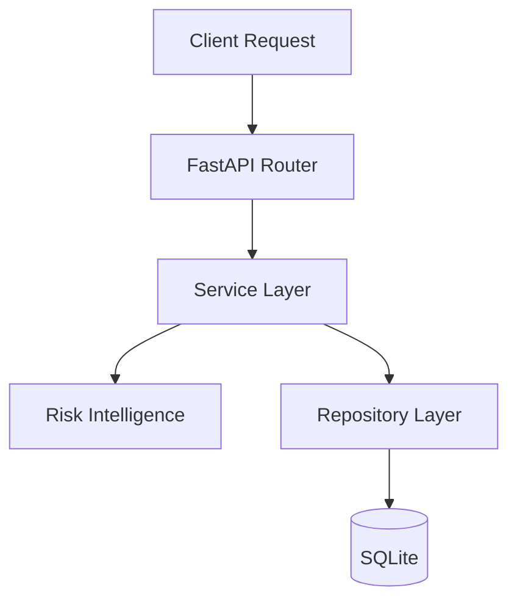
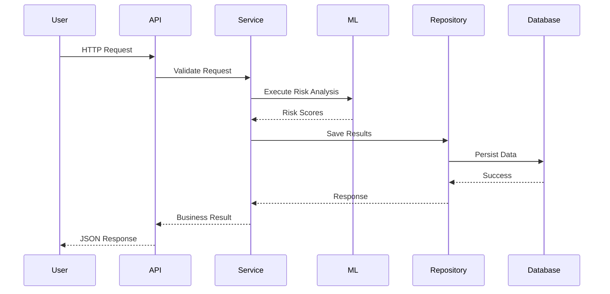

# Backend Architecture

---

**Project:** VERIS
**Document:** Backend Architecture
**Version:** 1.0 Portfolio Release
**Last Updated:** June 2026
---------------------------

# Backend Architecture

## Overview

The VERIS backend is built using **FastAPI** and follows a layered architecture that separates API routing, business logic, data persistence, and analytical processing. This modular design improves maintainability, readability, and future extensibility while keeping each component focused on a single responsibility.

Rather than embedding business logic directly into API endpoints, VERIS delegates processing to dedicated service classes and repository modules. This architecture mirrors common enterprise backend design patterns.

---

# Technology Stack

| Component         | Technology            |
| ----------------- | --------------------- |
| Framework         | FastAPI               |
| Language          | Python                |
| ORM               | SQLAlchemy            |
| Database          | SQLite (Development)  |
| ML Libraries      | Scikit-learn, XGBoost |
| Serialization     | Pydantic              |
| API Documentation | OpenAPI / Swagger     |

---

# Backend Architecture

---

# Layer Responsibilities

## API Router Layer

The Router Layer exposes REST endpoints for each functional module.

Responsibilities include:

* Request routing
* Input validation
* Response formatting
* HTTP status management
* Service invocation

Business rules are intentionally excluded from this layer.

Current router groups include:

* Dashboard
* Transactions
* Uploads
* Reports
* Research
* AI Analyst
* Simulator
* Alerts
* Audit
* Model Performance
* Explainability

---

## Service Layer

The Service Layer contains the core business logic of VERIS.

Responsibilities include:

* Upload validation
* Schema mapping
* Batch processing
* Feature engineering
* Fraud scoring
* Proxy credit scoring
* Unified Risk Score calculation
* Decision generation
* Review workflow
* Report generation
* Audit logging

Each service is responsible for a specific business capability, improving modularity and simplifying future enhancements.

---

## Risk Intelligence Layer

The analytical layer executes all machine learning and scoring operations.

Major components include:

* Fraud Engine
* Proxy Credit Engine
* Feature Pipeline
* Unified Risk Service
* Decision Service
* Explainability Engine

These components operate independently while contributing to a unified transaction decision.

---

## Repository Layer

The Repository Layer abstracts database interactions.

Responsibilities include:

* Transaction persistence
* Upload batch storage
* Audit logging
* Query execution
* Data retrieval

This abstraction allows business services to remain independent of database implementation details.

---

## Database Layer

SQLite is used as the development database.

Stored entities include:

* Transactions
* Upload batches
* Audit records
* Review outcomes

The architecture supports migration to PostgreSQL or other relational database systems with minimal changes.

---

# Request Lifecycle

---

# Separation of Concerns

VERIS follows clear separation between layers.

| Layer      | Responsibility      |
| ---------- | ------------------- |
| Router     | HTTP communication  |
| Service    | Business logic      |
| ML Layer   | Risk analytics      |
| Repository | Database operations |
| Database   | Data persistence    |

This organization improves maintainability and allows each layer to evolve independently.

---

# Error Handling

The backend implements centralized error handling through FastAPI.

Typical error scenarios include:

* Invalid dataset structure
* Missing required fields
* Transaction lookup failures
* Processing exceptions
* Validation errors

Meaningful HTTP status codes and structured JSON responses improve frontend integration and debugging.

---

# Extensibility

The modular backend allows additional functionality with minimal architectural changes.

Potential future enhancements include:

* Enterprise RBAC
* JWT Authentication
* PostgreSQL
* Redis caching
* Background workers
* Message queues
* Docker deployment
* Cloud storage integration

The current architecture is intentionally designed to accommodate these improvements.

---

# Strengths of the Architecture

* Clear separation between API, business logic, analytics, and persistence
* Modular services supporting independent development
* Reusable analytical components
* Clean repository abstraction
* Enterprise-inspired layered design
* Easy integration with additional models or business rules

---

# Current Limitations

The backend is designed as an educational implementation.

Current limitations include:

* SQLite for development
* Simulated role management
* Batch-oriented processing
* Local deployment
* Simplified persistence model

These trade-offs keep the project lightweight while effectively demonstrating enterprise backend architecture.

---

# Key Takeaways

* VERIS adopts a layered FastAPI architecture inspired by enterprise backend systems.
* Business logic is isolated from API routing and database access.
* Machine learning components integrate seamlessly through dedicated services.
* Repository abstraction improves maintainability and future scalability.
* The backend demonstrates sound software engineering principles while remaining accessible as an educational portfolio project.
