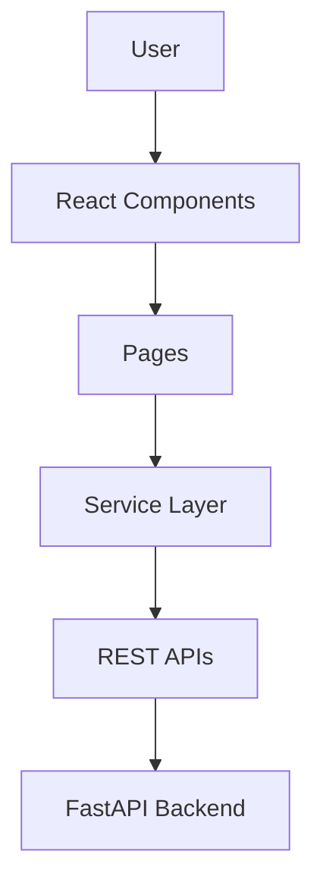
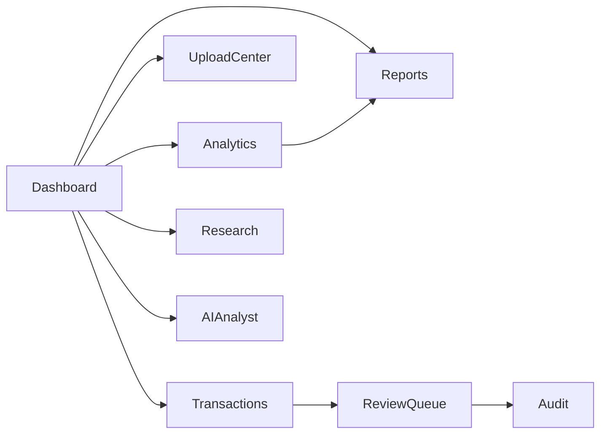
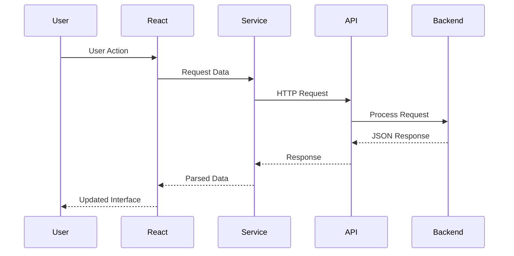

# Frontend Architecture

---

**Project:** VERIS
**Document:** Frontend Architecture
**Version:** 1.0 Portfolio Release
**Last Updated:** June 2026
---------------------------

# Frontend Architecture

## Overview

The VERIS frontend is developed using **React**, **TypeScript**, and **Tailwind CSS** to provide an interactive user interface for transaction monitoring, risk analysis, operational decisioning, and business intelligence.

Rather than functioning as a simple visualization layer, the frontend serves as the operational interface through which analysts interact with the platform. It consumes REST APIs exposed by the FastAPI backend and presents analytical results through dashboards, tables, charts, reports, and workflow-oriented screens.

---

# Technology Stack

| Component   | Technology   |
| ----------- | ------------ |
| Framework   | React        |
| Language    | TypeScript   |
| Build Tool  | Vite         |
| Styling     | Tailwind CSS |
| Charts      | Recharts     |
| HTTP Client | Fetch API    |
| Routing     | React Router |

---

# Frontend Architecture



---

# Design Philosophy

The frontend follows four guiding principles:

* Component Reusability
* Separation of UI and Business Logic
* Consistent User Experience
* Modular Feature Development

Business logic remains on the backend while the frontend focuses on presentation, interaction, and workflow orchestration.

---

# Application Structure

The application is organized into independent feature modules.

```text
src/

├── components/
├── pages/
├── services/
├── routes/
├── api/
├── assets/
├── types/
└── main.tsx
```

Each directory has a clearly defined responsibility, improving maintainability as the application grows.

---

# Pages

The application consists of several functional pages that represent different stages of the transaction decision lifecycle.

| Page          | Business Purpose              |
| ------------- | ----------------------------- |
| Dashboard     | Operational overview and KPIs |
| Transactions  | View transaction details      |
| Upload Center | Import transaction datasets   |
| Review Queue  | Human review workflow         |
| Analytics     | Risk and performance analysis |
| Research      | Explore analytical insights   |
| Reports       | Generate operational reports  |
| Simulator     | Test decision scenarios       |
| Alerts        | Monitor important events      |
| Audit         | Review system activities      |
| AI Analyst    | Explain transaction decisions |

Each page communicates with dedicated backend services to retrieve or update information.

---

# Component Architecture

The frontend is built using reusable UI components.

Examples include:

* Metric Cards
* Risk Cards
* Charts
* Data Tables
* Sidebar
* Header
* Review Widgets
* Upload Widgets
* Simulator Widgets

Reusable components reduce duplication and maintain a consistent user interface across modules.

---

# Service Layer

The frontend service layer isolates API communication from user interface components.

Current services include:

* Dashboard Service
* Transaction Service
* Upload Service
* Report Service
* Research Service
* AI Analyst Service

Responsibilities include:

* Sending HTTP requests
* Receiving API responses
* Parsing JSON data
* Handling errors
* Providing reusable methods for pages

---

# Navigation Flow



Navigation follows the natural workflow of transaction processing while allowing users to access analytical modules independently.

---

# Data Flow



---

# User Experience

The interface is designed to minimize navigation complexity while presenting analytical information in a structured manner.

Key principles include:

* Simple navigation
* Consistent layouts
* Interactive visualizations
* Clear transaction workflows
* Immediate feedback after user actions

These principles improve usability for operational users such as analysts and managers.

---

# Visualization Strategy

VERIS emphasizes visual analytics rather than raw numerical outputs.

The interface includes:

* KPI cards
* Risk distribution charts
* Decision distribution charts
* Trend analysis
* Transaction tables
* Performance metrics

Visual representations help users identify operational patterns more efficiently than tabular data alone.

---

# Strengths of the Architecture

* Modular React structure
* Reusable components
* Dedicated service layer
* Feature-based organization
* Responsive interface
* Clear separation from backend business logic
* Easy integration with new modules

---

# Current Limitations

The frontend intentionally simplifies certain enterprise concerns.

Examples include:

* Simulated authentication
* No global state management library
* Local configuration
* Limited offline support
* Local API integration

These trade-offs keep the application lightweight while effectively demonstrating enterprise frontend design concepts.

---

# Future Enhancements

Potential improvements include:

* Redux Toolkit or Zustand
* Enterprise RBAC
* Theme customization
* Internationalization (i18n)
* Real-time notifications
* WebSocket integration
* Progressive Web App support
* Advanced accessibility features

---

# Key Takeaways

* The VERIS frontend provides a modular, component-based interface for enterprise transaction decisioning.
* React and TypeScript enable maintainable, scalable UI development.
* Business logic remains within backend services while the frontend focuses on presentation and interaction.
* Reusable components and service abstraction improve maintainability and extensibility.
* The frontend demonstrates enterprise dashboard design principles suitable for analytical platforms and decision-support systems.
