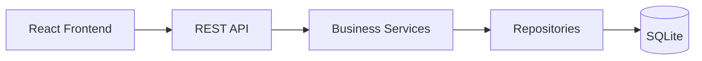
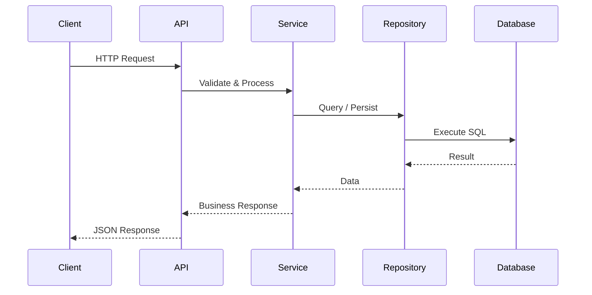
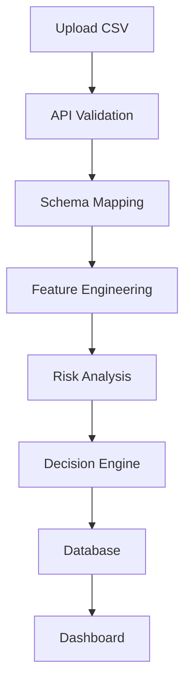

# API Architecture

---

**Project:** VERIS
**Document:** API Architecture
**Version:** 1.0 Portfolio Release
**Last Updated:** June 2026
---------------------------

# API Architecture

## Overview

VERIS exposes its functionality through a RESTful API built using FastAPI. The API serves as the communication layer between the React frontend and the backend services, allowing different modules of the platform to exchange information in a consistent, scalable, and modular manner.

The API is organized around business capabilities rather than technical implementation details. Each router represents a functional area of the platform and delegates processing to dedicated service classes.

---

# API Design Principles

The API follows several design principles:

* Resource-oriented endpoints
* Consistent HTTP methods
* JSON request and response bodies
* Modular router organization
* Separation of routing and business logic
* Stateless communication
* Predictable response structure

These principles simplify frontend integration and improve maintainability.

---

# High-Level Architecture



---

# Request Lifecycle



---

# API Module Organization

The backend organizes endpoints into independent functional modules.

| Module            | Business Purpose                         |
| ----------------- | ---------------------------------------- |
| Dashboard         | Operational KPIs and summary metrics     |
| Transactions      | Retrieve and manage transaction records  |
| Uploads           | Upload and validate transaction datasets |
| Reports           | Export analytical reports                |
| Research          | Analytical exploration and insights      |
| AI Analyst        | Explain transaction decisions            |
| Simulator         | Simulate decision scenarios              |
| Alerts            | Risk notifications                       |
| Audit             | Audit trail and governance               |
| Model Performance | ML performance metrics                   |
| Explainability    | Model explanation services               |

Each router exposes endpoints specific to its business domain while relying on shared services for implementation.

---

# HTTP Methods

VERIS uses standard REST conventions.

| Method | Purpose                                       |
| ------ | --------------------------------------------- |
| GET    | Retrieve resources                            |
| POST   | Create new resources or trigger processing    |
| PATCH  | Update existing resources                     |
| DELETE | Reserved for future administrative operations |

Using standard HTTP semantics improves interoperability and developer familiarity.

---

# Response Structure

The API returns JSON responses.

Typical response includes:

* Requested data
* Processing results
* Status information
* Error details (when applicable)

Example:

```json
{
  "status": "success",
  "message": "Transactions retrieved successfully",
  "data": [...]
}
```

---

# Error Handling

The API provides structured error responses for predictable client-side handling.

Examples include:

* 400 Bad Request
* 404 Not Found
* 422 Validation Error
* 500 Internal Server Error

Meaningful status codes and descriptive messages simplify debugging and frontend development.

---

# Input Validation

Incoming requests are validated before entering the business layer.

Validation covers:

* Required fields
* Data types
* CSV schema validation
* Missing values
* Invalid transaction identifiers

This prevents malformed requests from reaching downstream services.

---

# Security Considerations

The current implementation is intended for educational purposes.

Current capabilities include:

* Input validation
* Structured API responses

Future enterprise enhancements include:

* JWT Authentication
* Role-Based Access Control (RBAC)
* OAuth2 integration
* Rate limiting
* API versioning
* Request logging
* HTTPS deployment

These features can be incorporated without major architectural changes.

---

# API Workflow

The following diagram illustrates a typical transaction upload workflow.



---

# Strengths of the API Architecture

* RESTful design
* Modular router organization
* Consistent JSON communication
* Strong separation between routing and business logic
* Easy frontend integration
* Scalable architecture for future modules

---

# Current Limitations

The API intentionally simplifies several production concerns.

Current limitations include:

* Simulated authentication
* Local deployment
* SQLite backend
* No API gateway
* No distributed caching
* No asynchronous message broker

These simplifications allow the project to focus on demonstrating API architecture rather than production infrastructure.

---

# Future Enhancements

Potential improvements include:

* JWT Authentication
* Enterprise RBAC
* API versioning
* Docker deployment
* Kubernetes support
* Redis caching
* Background workers
* Event-driven architecture
* OpenTelemetry monitoring

---

# Key Takeaways

* VERIS exposes its capabilities through a modular REST API built with FastAPI.
* API routers are organized around business domains rather than implementation details.
* Request processing is delegated to dedicated service and repository layers.
* Input validation and structured responses improve reliability and maintainability.
* The API architecture is designed to support future enterprise enhancements while remaining lightweight for educational purposes.
