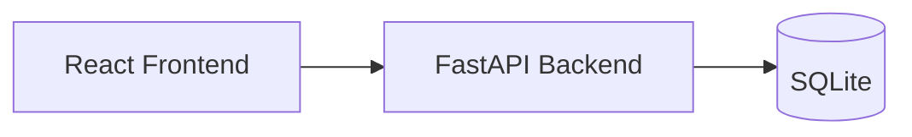
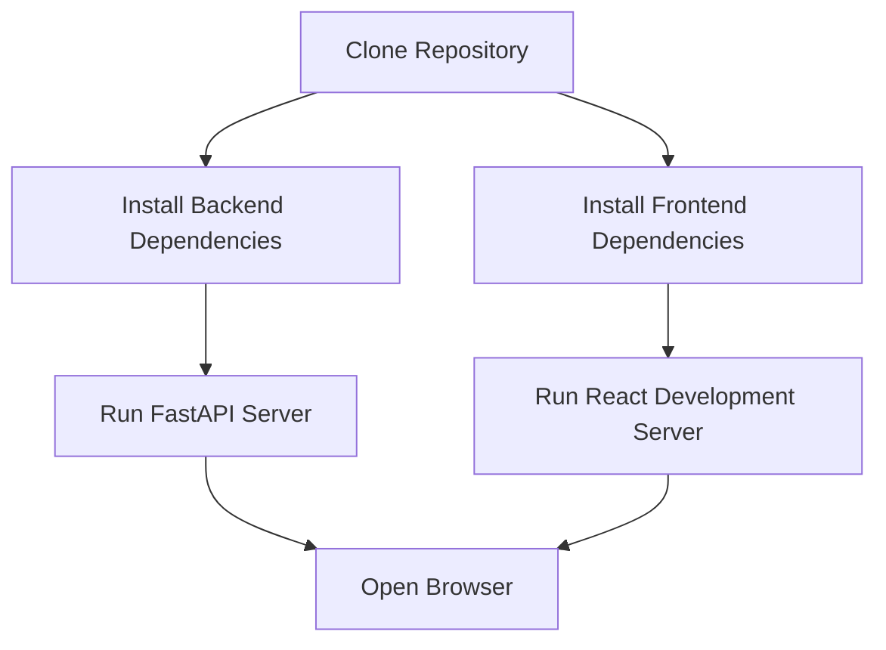
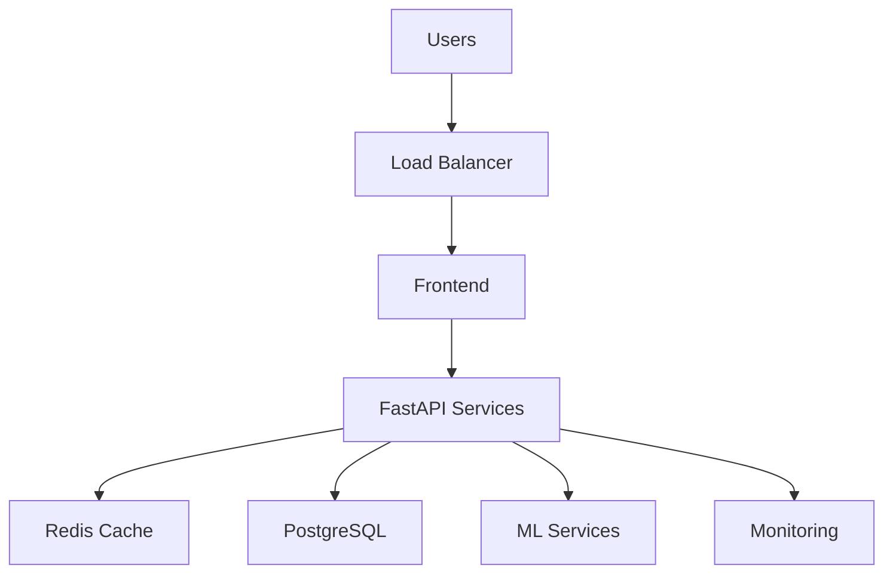

# Deployment and Future Roadmap

---

**Project:** VERIS
**Document:** Deployment and Future Roadmap
**Version:** 1.0 Portfolio Release
**Last Updated:** June 2026
---------------------------

# Deployment and Future Roadmap

## Overview

VERIS has been developed as a modular portfolio project that demonstrates enterprise transaction decisioning concepts using a lightweight local deployment. Although the current implementation targets educational and demonstration purposes, the underlying architecture has been designed to support future migration toward a production-oriented environment.

This document describes the current deployment model, deployment workflow, operational considerations, and the planned roadmap for future enhancements.

---

# Current Deployment Architecture

The current deployment consists of three primary components:

* React Frontend
* FastAPI Backend
* SQLite Database

All components execute locally during development while communicating through REST APIs.

---

# Current Development Environment

| Component         | Technology                        |
| ----------------- | --------------------------------- |
| Frontend          | React + TypeScript + Tailwind CSS |
| Backend           | FastAPI                           |
| Database          | SQLite                            |
| Machine Learning  | Scikit-learn + XGBoost            |
| API Documentation | Swagger UI                        |
| Version Control   | Git & GitHub                      |

This environment provides a lightweight setup suitable for development, experimentation, and portfolio demonstrations.

---

# Local Deployment Workflow

Deployment requires only Python, Node.js, and the project dependencies.

---

# Application Startup

## Backend

The backend initializes:

* Database connection
* API routers
* Machine learning models
* Business services
* Repository layer

Once initialized, FastAPI exposes REST endpoints for frontend communication.

---

## Frontend

The frontend starts the React development server.

Responsibilities include:

* Loading application routes
* Rendering dashboard pages
* Calling backend APIs
* Displaying analytical visualizations
* Managing user interactions

---

# Deployment Considerations

The current implementation intentionally simplifies production infrastructure.

Current characteristics include:

* Local execution
* SQLite database
* Batch transaction processing
* Local file storage
* Simulated authentication

These decisions reduce setup complexity while allowing the project to demonstrate enterprise architectural concepts.

---

# Production Architecture Vision

A production-ready implementation could adopt the following architecture.

This architecture supports improved scalability, availability, and operational monitoring.

---

# Recommended Future Enhancements

## Infrastructure

* Docker containerization
* Docker Compose
* Kubernetes deployment
* Cloud hosting
* Reverse proxy configuration

---

## Database

Replace SQLite with PostgreSQL.

Benefits include:

* Better concurrency
* Improved scalability
* Transaction management
* Enterprise compatibility

---

## Authentication

Current implementation:

* Simulated role management

Future implementation:

* JWT Authentication
* OAuth2
* Role-Based Access Control (RBAC)
* Session management

---

## Machine Learning

Future improvements include:

* Automated model retraining
* Model versioning
* Drift detection
* Feature Store integration
* Real-time scoring
* Ensemble learning

---

## Explainability

Potential enhancements include:

* Full SHAP integration
* Feature importance dashboards
* Decision confidence visualization
* Counterfactual explanations

---

## Analytics

Future analytical capabilities:

* Real-time dashboards
* Streaming analytics
* Historical trend forecasting
* Executive reporting
* Custom KPI builder

---

## DevOps

Potential DevOps improvements:

* GitHub Actions
* CI/CD pipelines
* Automated testing
* Deployment automation
* Infrastructure as Code

---

## Monitoring

Enterprise monitoring may include:

* Prometheus
* Grafana
* Centralized logging
* Health monitoring
* Performance metrics
* Alert management

---

# Scalability Strategy

The modular architecture allows each layer to evolve independently.

Possible scaling strategies include:

* Horizontal API scaling
* Independent ML services
* Distributed databases
* Background task queues
* Microservice decomposition

These enhancements can be introduced without major architectural redesign.

---

# Educational Scope

VERIS is intentionally positioned as an educational portfolio project.

The objective is to demonstrate:

* Enterprise software architecture
* Risk analytics concepts
* Decision intelligence
* Explainable AI
* Human-in-the-loop workflows

It does **not** attempt to replicate proprietary banking infrastructure or production-grade financial systems.

---

# Future Vision

Future releases of VERIS aim to evolve from a local portfolio application into a more production-oriented analytical platform.

Potential milestones include:

| Version | Planned Enhancement                     |
| ------- | --------------------------------------- |
| v1.1    | PostgreSQL integration                  |
| v1.2    | Docker deployment                       |
| v1.3    | JWT Authentication & RBAC               |
| v1.4    | Real-time transaction streaming         |
| v1.5    | Explainability dashboard                |
| v2.0    | Cloud-native deployment with monitoring |

These milestones represent a natural evolution of the current architecture rather than fundamental redesigns.

---

# Key Takeaways

* VERIS currently operates as a lightweight local deployment suitable for education and portfolio demonstrations.
* The layered architecture supports future migration toward enterprise deployment models.
* Planned enhancements focus on scalability, security, automation, explainability, and cloud readiness.
* The current implementation prioritizes architectural understanding while maintaining a clear path toward production-oriented capabilities.
* The roadmap reflects realistic engineering progression rather than speculative feature expansion.
